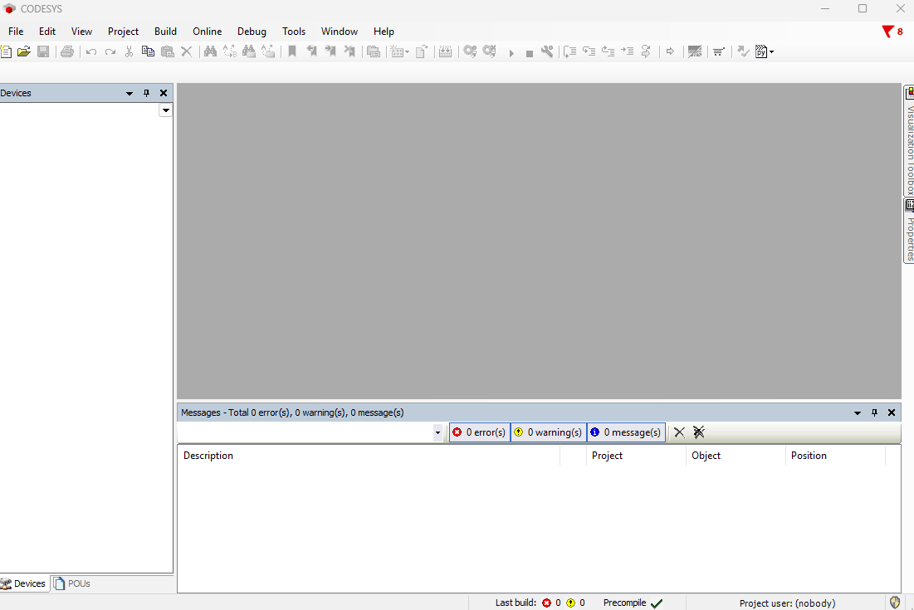

# Installation

## Requirements

- **Minimum Tested Target**: CODESYS V3.5 SP10+ (earlier versions might support
  scripting but lack essential API features for reliable text syncing).
- **Recommended Target**: CODESYS V3.5 SP13 and newer.
- **Python 3.11+ Required**: CODESYS/IronPython is used only as a thin IDE bridge.
  Export, compare, import, options, diagnostics, and the CLI use the external
  Python 3 engine, so `python` must be available from the Windows command line.

Check before running the scripts:

```powershell
python --version
```

If this command is not found or reports a version below 3.11, install Python
3.11 or newer and configure your environment so `python` points to it. The quick
PowerShell installer also checks for
`python` up front and can offer a manual download page or a `winget`
installation path if it is missing.

---

## How the install is laid out

Two folders, and it is worth knowing which is which:

- **Program folder** — the tool itself. Default `%LOCALAPPDATA%\cds-text-sync\`,
  or any folder you choose, including a Git clone.
- **ScriptDir** — the CODESYS scripting folder. It receives **only the generated
  `Project_*.py` menu scripts**, nothing else.

The split is not cosmetic. CODESYS scans its ScriptDir recursively and lists
every `.py` it finds, so installing the whole tool there would put ~120 internal
modules into **Tools > Scripting** alongside the ten commands you actually use.
Keeping the program out of ScriptDir is what keeps that menu clean.

Run `cts where` at any time to see both paths and whether the menu is in order.

---

## Method 1: Quick PowerShell Setup (Recommended)

Automate everything — download, both folders, CLI, menu — with one command:

```powershell
irm https://raw.githubusercontent.com/ArthurkaX/cds-text-sync/main/irm/setup.ps1 | iex
```

> [!NOTE]
> - **No Git required**: This script downloads clean zip archives from GitHub,
>   not the full repository with history.
> - **Choose version**: You can select the latest development version, a stable
>   release, or a test / pre-release build from the interactive menu.
> - **Prints a map**: The installer ends by printing the program folder, the
>   menu folder, and the CLI command, so you never have to guess where things
>   went.
> - **Migrates older installs**: If a previous version sits inside ScriptDir,
>   the installer moves it out and generates the menu scripts in its place.
>   Your own files under `profiles/` are carried across.

> [!TIP]
> For a detailed explanation of what the script does, check the
> [Quick Setup Guide](../irm/setup.md).

---

## Method 2: Manual Copy

Extract the archive **anywhere except a CODESYS ScriptDir** — for example
`%LOCALAPPDATA%\cds-text-sync\` — then, from that folder:

```powershell
python -m pip install -e .
cts install-menu
```

`cts install-menu` finds every CODESYS ScriptDir on the machine and writes the
`Project_*.py` menu scripts into it. If `pip` was skipped or failed, the same
generator runs directly:

```powershell
python -m cds_text_sync.install_menu
```

- **Note on `cds_bootstrap.py`**: This is a support loader used by the public
  `Project_*.py` entrypoints. Do not run it directly.

These are the ScriptDir locations the generator knows about; it writes into the
ones that exist:

- **Standard (User Profile)**: `C:\Users\<YourUsername>\AppData\Local\CODESYS\ScriptDir\`
- **Legacy CODESYS (< ~3.5.17)**: `C:\ProgramData\CODESYS\ScriptDir\` — older
  CODESYS (e.g. 3.5.16) scans this machine-wide path, **not** the user profile
  one. May require administrator rights.
- **Standard CODESYS (Manual Setup)**: `C:\Program Files\CODESYS 3.5.18.40\CODESYS\ScriptDir\`
- **Delta Industrial Automation (DIAStudio)**: `C:\Program Files\Delta Industrial Automation\DIAStudio\DIADesigner-AX 1.9\CODESYS\ScriptDir`

Pass `--script-dir <path>` to target one explicitly, or `--all-script-dirs` to
serve several CODESYS installations from a single program folder.

> [!TIP]
> Using a different CODESYS version or fork? See the
> [Alternative Installations Guide](alternative-installations.md) for supported
> environments and installation paths.

---

## Method 3: Git clone

For updates through `git pull`, and for development. Clone **anywhere except a
ScriptDir**:

```powershell
git clone https://github.com/ArthurkaX/cds-text-sync C:\Tools\cds-text-sync
cd C:\Tools\cds-text-sync
python -m pip install -e .
python -m cds_text_sync.install_menu
```

Nothing has to be deleted from the clone, and nothing is copied into ScriptDir
except the generated menu scripts. Updating afterwards is just:

```powershell
git pull
```

The menu scripts point at the clone, so a pull takes effect immediately. Re-run
`cts install-menu` only if a release adds a new `Project_*` command; `cts where`
reports when the menu and the program folder have drifted apart.

---

## Install the CLI

`cts` is installed with Python packaging, from the program folder:

```powershell
python -m pip install -e <program-folder>
cts --help
```

This is what `cts`, the reverse-pipe daemon and [`cts visu`](visu.md) need. The
classic `Project_*.py` menu workflow works without it — but `cts install-menu`
is the easiest way to create those menu scripts, so installing the CLI first is
the smoother path.

---

## After installing

1. **Access in CODESYS**: the commands appear under
   **Tools > Scripting > Scripts > P**, and nothing else from this tool appears
   anywhere else in that menu.
2. **Add to Toolbar (Recommended)**: go to **Tools > Customize > Toolbars** and
   add the generated commands from **ScriptEngine Commands > P**. The commands
   are grouped under `P` because their names start with `Project_`.

   <details>
   <summary><strong>▶ Click to open the animation: adding Project_* scripts to a toolbar</strong></summary>

   <p></p>
   </details>

3. **Link a project to disk**: open the project in CODESYS, run
   `Project_directory.py` to set its sync folder, and then run
   `Project_export.py`. All supported `.st` and `.csv` text exports are enabled
   by default; use `Project_options.py` only for advanced changes. See
   [Script overview](scripts.md) and
   [Recommended workflow](project-layout.md#recommended-workflow-with-git-lfs).

---

## Upgrading from previous versions

1. **Check stable releases**: first check whether there is a newer stable release
   at [GitHub Releases](https://github.com/ArthurkaX/cds-text-sync/releases).
2. **Re-run the installer**, or replace the contents of the program folder and
   run `cts install-menu` again.
   - **Important**: active scripts held in CODESYS memory may become **stale**
     after replacing files. Restart CODESYS or reload your project so the Script
     Engine picks up the latest modules.
3. **Clean extract**: run `Project_export.py` to refresh `.dump/IDE.xml`, the
   configured view root, and manifest data with the latest script logic.
4. **Commit changes**: review and commit the changes in Git.

> **Upgrading from a version installed inside ScriptDir**: older releases put the
> whole tool in ScriptDir. Those installs keep working untouched, so there is no
> rush — but the IDE menu stays cluttered until you migrate. Re-running the
> quick installer does the move for you. Doing it by hand is the same two steps
> as a fresh install: move the folder out of ScriptDir, then run
> `cts install-menu` from its new location. Toolbar buttons survive either way,
> because the menu scripts keep their names.
>
> **Important when upgrading from pre-2.0 versions**: The current workflow uses
> the XML-first layout and requires Python 3. Run `Project_options.py` after
> upgrading, choose your layout/profile/projections, then run a clean
> `Project_export.py` before reviewing Git changes.
>
> **Tip**: A clean extract after upgrading ensures the exported XML views,
> projection files, and manifest data match the current engine behavior.
>
> **Rollback**: If you encounter issues with a new version, see
> [Releases & rollback](releases.md) for how to safely revert to a previous
> stable version.
