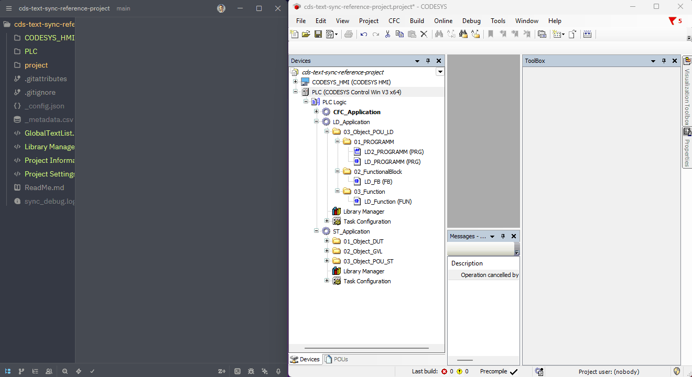
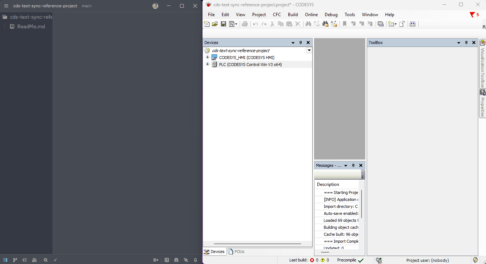
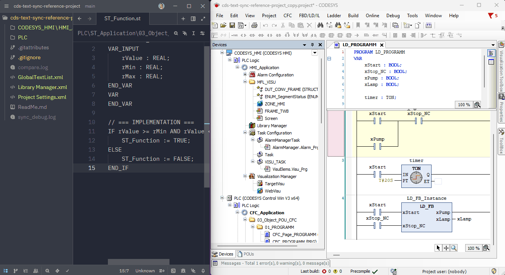

# Script Overview

The CODESYS-side entry points, in the order you use them. All of them appear
under **Tools > Scripting > Scripts > P** after [installation](install.md) —
and they are the only thing this tool puts in that menu. Every one of them has
a `cts` equivalent for shell and CI use — see [`cds_text_sync/CLI.md`](../cds_text_sync/CLI.md).

## 1. `Project_directory.py` (Setup)

**Run this first.** It links your current CODESYS project to a sync root on disk.

- Offers two options:
  - **Browse**: Select a folder using the file browser (traditional method).
  - **Manual Input**: Enter a path manually, supporting both absolute and
    relative paths.
- **Relative Path Support**:
  - Use `./` to sync to the same directory as your project file.
  - Use `./src/` or `./foldername/` to sync to a subfolder relative to your
    project.
  - **Perfect for team collaboration**: Relative paths work on any machine
    without reconfiguration, as they're resolved relative to the project file
    location.
  - The folder will be created automatically if it doesn't exist.
- Saves the sync-root path in the CODESYS project properties used by the active
  scripts.
- The selected sync root is then resolved into generated state such as `.dump/`
  and the editable view root such as `project-view/`.

**Examples**:

- Absolute path: `C:\MyProjects\MyPLC\sync\`
- Relative path (project directory): `./`
- Relative path (subfolder): `./sync/` or `./git-repo/src/`

## 2. Active sync commands

The active root entry points are `Project_directory.py`, `Project_options.py`,
`Project_export.py`, `Project_import.py`, `Project_compare_ui.py`,
`Project_build.py`, `Project_discover.py`, and `Project_resources.py`.

## 3. `Project_options.py` (Layout, Profile, Projections)

Use this after selecting the sync root.

- **Sync Mode**: Choose XML-first (default) or text-first. This is a one-time
  choice on an empty folder — see [Sync modes](sync-modes.md).
- **View Storage**: Choose default `project-view/`, root-view, or an explicit
  custom view root.
- **View Root Lock**: Choose the view storage before the first export. After
  `.dump/manifest.json` has been created, `Project_options.py` locks the layout
  and custom view root controls. To use a different export folder, start again
  with a clean sync directory.
- **Profile**: Select the active CODESYS profile for object type handling.
- **Projections**: Enable optional readable files such as `.st` and `.csv` based
  on the active profile.
- **Safety Backup**: Enable or disable timestamped binary backup before import
  and set how many generated backups to keep.
- **Completion Summary**: Show or hide the final import/export success popup.
- **Git Ignore Helper**: Append recommended generated-state ignore rules without
  rewriting existing user rules.

## 4. `Project_export.py` (CODESYS -> Disk)

Exports the current project state into the XML-first workspace under the
configured sync folder.

- **Fresh Snapshot**: Exports the live IDE project to `.dump/IDE.xml`.
- **Views Refresh**: Rebuilds the configured view root from the snapshot using
  the external Python 3 engine.
- **Manifest Update**: Writes `.dump/manifest.json` so later compare/import steps
  use the same exported object inventory.
- **Layout Guard**: Export, compare, and import fail with a clear error if the
  current view root does not match the manifest. This prevents duplicate editable
  folders after changing storage settings.
- **Offline-Friendly**: The heavy parsing and folder generation happen outside
  the IDE bridge.
- **Overwrite protection**: Local edits you have not imported yet are not
  silently overwritten — see
  [Overwrite protection](sync-modes.md#overwrite-protection-both-modes).

## 5. `Project_import.py` (Disk -> CODESYS)

Applies disk changes back into CODESYS using the XML-first bridge.

- **Snapshot Before Change**: Captures a fresh `.dump/IDE.xml` before planning any
  import.
- **Patch Build**: Runs the external engine against the configured view root and
  prepares `.dump/IMPORT.xml`.
- **Safety Backup**: When enabled, saves the open project and copies the project
  binary to `.backup/YYYYMMDD_HHMMSS_<project-name>.bak` before applying a patch
  that changes the IDE.
- **Native Apply**: Textual objects are applied with CODESYS text APIs, then
  remaining non-textual XML is applied through native import.
- **Creates**: New standalone `.st` files can create supported text objects when
  the object kind is clear from the source. This is also how a screen compiled by
  [`cts visu from-svg`](visu.md) reaches the IDE.

## 6. `Project_compare_ui.py` (IDE vs Disk)

Shows what differs between the current IDE state and the exported disk view,
and lets you act on it.

- **Fresh Compare Snapshot**: Exports the current IDE state to
  `.dump/IDE.current.xml`.
- **View Baseline**: Compares that snapshot against the configured view root
  using the external diff engine.
- **Report Output**: Writes `.dump/compare_report.json` with object names and
  paths, for diagnostics and follow-up review.
- **Object List**: Shows the differing objects in a CODESYS dialog.
- **Actions**: Can launch import or export from the dialog. Checked objects can be
  applied selectively when the external engine can resolve them by GUID.

For a compare without any dialog — in a shell, in CI, or from the daemon — use
[`cts compare`](../cds_text_sync/CLI.md).

## 7. Optional projections

Projections are editable views generated from XML-backed CODESYS objects. They
are optional in XML-first mode and selected in `Project_options.py`; in
[text-first mode](sync-modes.md#text-first-opt-in) the `.st` ones are always on.

- **POU `.st`**: Declaration/interface first, then `// --- implementation ---`,
  then implementation.
- **POU children `.st`**: Methods, actions, properties, and accessors are emitted
  as flat sibling files such as `ST_FB.ST_METHOD.st`.
- **GVL, persistent variables, and DUT `.st`**: Global variables, persistent
  variable lists, task-local GVLs, and DUT declarations can be edited as text
  files.
- **TypeGuid metadata pragmas**: Ambiguous `.st` projections may start with
  `(* cds-text-sync: TypeGuid="{...}" *)`; this is a sync hint only and is
  stripped before XML rehydration or IDE text updates.
- **Text list `.csv`**: Existing `TextID` rows and language values can be edited
  for translation workflows.
- **Alarm item `.csv`**: Existing alarm rows can be edited by stable `AlarmID`.
- **Conflict Handling**: If both the redacted XML and its projection changed,
  compare/import fails explicitly instead of choosing a source silently.

CSV projections are update-only in this release. Inserted, removed, renamed, or
duplicate rows fail explicitly. CODESYS supports only one Persistent Variables
object per application, so creating a second one from a new `.st` file is
rejected before IDE apply. Graphical implementations are skipped by profile
safety rules unless a safe textual representation is available.

## 8. Diagnostics

- **`Project_build.py`**: Builds the active or selected application and writes
  `.dump/build_<Application>.log` plus `.dump/build_report.json`.
- **`Project_discover.py`**: Captures the live IDE tree and profile/type
  resolution into `.dump/discover_tree.log` and `.dump/discover_report.json`.
- **`Project_resources.py`**: Analyzes snapshot object sizes and categories,
  writing `.dump/resources_report.json` and `.dump/resources_top.log`.
- **`Project_daemon.py`**: Starts the reverse-pipe daemon so the `cts` CLI can
  drive the open IDE. See [`cds_text_sync/CLI.md`](../cds_text_sync/CLI.md).
- Offline static call graph via `cts engine call-tree`. See `--help` for options.
