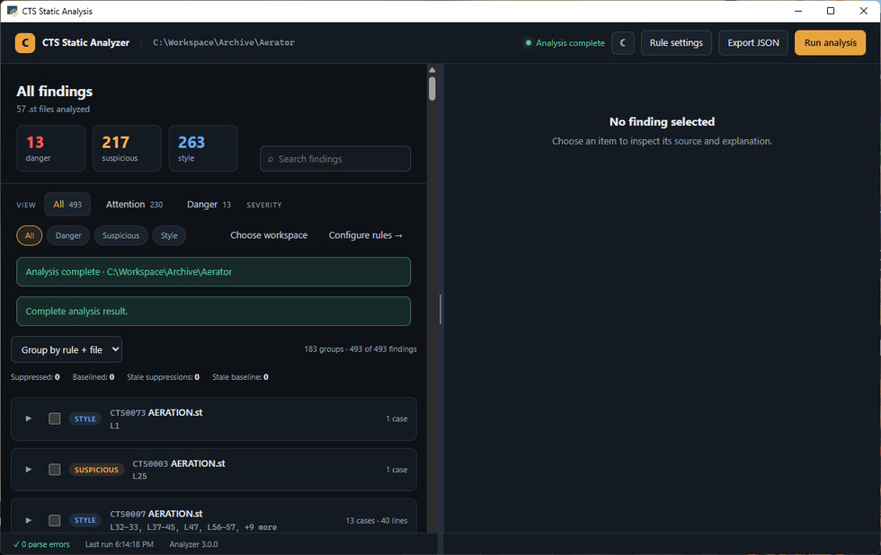
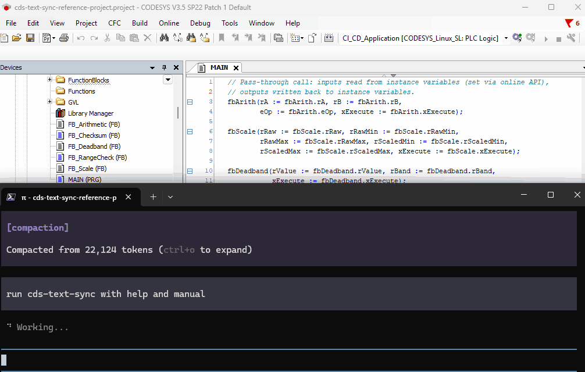
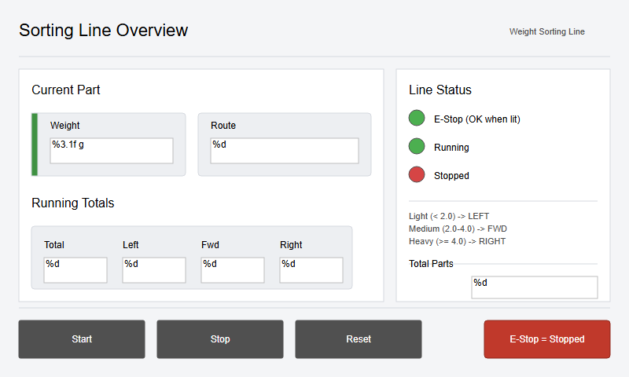

# cds-text-sync

[](https://github.com/ArthurkaX/cds-text-sync/actions/workflows/ci.yml)
[](https://github.com/ArthurkaX/cds-text-sync/releases)
[](LICENSE)

Turn a binary CODESYS project into a folder that Git, editors, CI tools and
LLM agents can understand. Export the project, review or change its text on
disk, then import it back into CODESYS.

This is an independent MIT-licensed tool, not an official CODESYS product.

## 1. Quick start

Requirements: Windows, CODESYS V3.5 SP10+ (SP13+ recommended), and Python 3.11+.

Install the tool and CODESYS menu scripts:

```powershell
irm https://raw.githubusercontent.com/ArthurkaX/cds-text-sync/main/irm/setup.ps1 | iex
```

For each project, the important path is:

1. Open the project in CODESYS and run **`Project_directory.py`**. Choose the
   sync folder for this project.
2. Run **`Project_export.py`**. All supported `.st` and `.csv` text exports are
   enabled by default.
3. Edit `project-view/` and commit the changes to Git.
4. Run **`Project_import.py`** to apply disk changes back to CODESYS.

That is enough for the first export/import cycle. `Project_options.py` is only
needed for advanced settings such as sync mode, layout, profile or projection
selection. See the [installation guide](docs/install.md) if the scripts do not
appear under **Tools > Scripting**.

## 2. Git workflows

Choose the workflow on an **empty sync folder before the first export**. The
mode is fixed for that folder; changing it later means creating a new empty
sync folder and exporting again.

### I only want readable `.st` files

Choose **text-first** in `Project_options.py`.

- `.st` is the source of truth for Structured Text edits.
- Structural XML is kept in the tool-owned `.dump/xml/` mirror instead of the
  normal Git view.
- This is the convenient mode for external editors, code review and LLM work.
- XML objects that must stay hand-editable, such as visualizations, can still
  be kept in the view.

### I need full control, including XML

Keep the default **XML-first** mode.

- Native XML in `project-view/` is the canonical round-trip format.
- Readable `.st` and `.csv` projections are generated beside it; all supported
  text projections are enabled by default.
- This mode is the right choice when Git must show and control devices, tasks,
  visualizations and other non-ST project structure as well.

More detail: [sync modes](docs/sync-modes.md), [project layout](docs/project-layout.md),
and [team workflow](docs/workflow.md).

## 3. I want to find errors in my project

Export the project first, then run the analyzer against its `.st` files. It is
offline: no CODESYS window, daemon or PLC connection is required.

```powershell
cts analyze --workspace C:\path\to\sync-folder
cts analyze --workspace C:\path\to\sync-folder --format sarif  # CI/code scanning
cts analyze rules
cts analyze explain CTS0007  # for example, indentation
```

You can open the desktop findings view with **`Project_analyze_ui.py`**. Safe
autofixes are previewed before they are applied, including structural
indentation fixes where available.

<details>
<summary><strong>▶ Click to open the animation: Static Analyzer findings UI</strong></summary>

<p></p>
</details>

Details: [static analyzer](products/cds-static-analyzer/README.md).

For a quick local cleanup inside CODESYS, select a Structured Text object in
the project tree and run **`Project_fmt.py`**. It opens a side-by-side preview
for declaration alignment and code indentation. Changed lines are highlighted,
and the review can be run for one object or as an **Apply / Skip / Stop** wizard
without starting the full Analyzer. Formatting is applied directly to the
open IDE object and remains subject to the normal CODESYS Undo command.

## 4. I want an LLM agent to control the project

Start **`Project_daemon.py`** from CODESYS Tools > Scripting. It exposes the
currently open project to the `cts` CLI. An agent can then export, inspect,
change, compare, import and build without clicking through the IDE:

```powershell
cts status                 # check daemon, project and sync folder
cts export                 # CODESYS -> project-view/
cts compare                # inspect IDE vs disk
cts import                 # project-view/ -> CODESYS
cts build                  # build the active application
cts analyze --workspace .  # offline check; daemon is not required
```

<details>
<summary><strong>▶ Click to open the animation: using the cts CLI</strong></summary>

<p></p>
</details>

The CLI also exposes project-tree operations, PLC interaction, tests and
diagnostics. Read the [CLI reference](products/cds-text-sync/src/cds_text_sync/CLI.md).

### Generate visualization screens from SVG

An agent can create an SVG sketch as plain text, lint and preview it, compile it
into a CODESYS visualization, and import the result through the same daemon:

```powershell
cts visu new --name Line1 --w 1024 --h 600 --out line1.svg
cts visu lint --svg line1.svg --fix
cts visu preview --svg line1.svg
cts visu from-svg --svg line1.svg --create-screen --screen-name Line1
cts import
```



Details: [HMI screens from SVG](docs/visu.md).

The current agent interface is the shell CLI. If an MCP server would fit your
workflow better, open an [issue](https://github.com/ArthurkaX/cds-text-sync/issues)
and describe the tools your agent needs; that is a natural next adapter for the
same daemon contract.

## Documentation

- [Installation](docs/install.md)
- [Sync modes](docs/sync-modes.md)
- [Script overview](docs/scripts.md)
- [Project layout](docs/project-layout.md)
- [CLI reference](products/cds-text-sync/src/cds_text_sync/CLI.md)
- [Static analyzer](products/cds-static-analyzer/README.md)
- [HMI screens from SVG](docs/visu.md)
- [Profiles](profiles/profiles.md)
- [Releases and rollback](docs/releases.md)

Issues, friction reports and feature requests are welcome in the [GitHub issue
tracker](https://github.com/ArthurkaX/cds-text-sync/issues). See the
[changelog](CHANGELOG.md) for release history.

MIT License.
